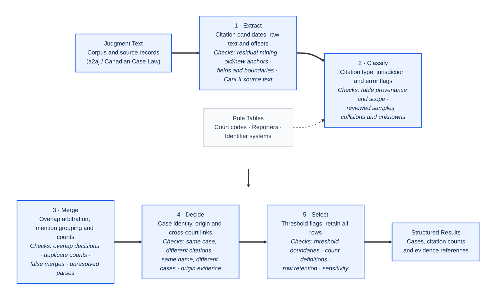
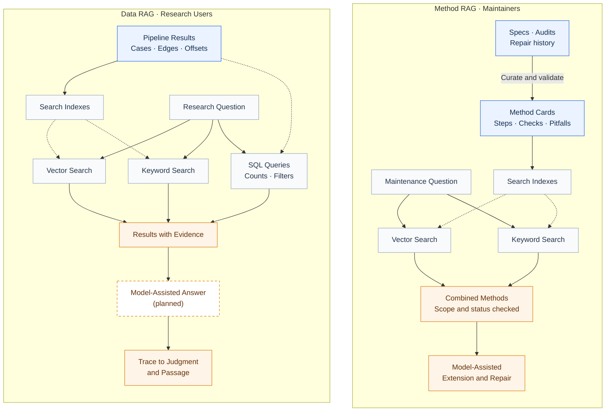

# Case Citation Pipeline


[](https://huggingface.co/datasets/a2aj/canadian-case-law)


A method for turning any collection of court judgments into an auditable citation network: find every case citation in the text, work out which case each one points to, and count how many judgments cite it, with every number traceable to a judgment and a character offset. Which courts to run is a setting. The method can run on whatever courts the [a2aj corpus](https://huggingface.co/datasets/a2aj/canadian-case-law) provides; it has been run end to end and checked against CanLII on three of them so far (SCC, ONCA, BCCA). Two retrieval (RAG) layers sit on top: one serves research questions over the results, the other holds the project's methods so the pipeline can be extended to new courts and citation styles.

| | |
| --- | --- |
| **The problem** | Knowing which cases a court actually relies on, foreign or domestic, means counting citations across its whole history. Judgments print the same case in many forms (neutral citations, several reporters, vendor IDs, 19th-century footnote styles), and a fixed abbreviation list misses most of them. |
| **The approach** | Five one-way layers: extract every citation-shaped string, classify it against rule tables whose rows each cite a printed source, merge identical strings, decide which strings are the same case, and select by citation count. Rows are flagged, never deleted. |
| **What it looks like** | CSV tables per layer (candidates, classified rows, case groups, citation edges), and a SQLite results database with two RAG layers: hybrid keyword and vector search over cases for research, and over the project's code, audits and method cards for maintenance. See [the example](#example-one-paragraph-through-two-layers) and [Two RAG layers](#two-rag-layers-on-top-of-the-pipeline). |
| **Stack** | Python 3.11, standard library plus `pyarrow` and `PyYAML`. Search uses SQLite FTS, `sqlite-vec` and OpenRouter embeddings. |
| **How well it works** | 215 hand-checked citation edges from 360 judgments compared with CanLII: 87.0% are real case citations (roughly 75–92%), rising to 98.9–100% for cases cited by five or more judgments. About 880 test checks pass locally; there is no CI because the tests read the downloaded corpus. See [How well it works](#how-well-it-works). |
| **Scope** | Courts are chosen with `PIPELINE_COURTS`. A new court needs its corpus file and, where it uses reporters or codes the rule tables lack, new table rows; [`docs/method_cards/00_new_court_playbook.md`](docs/method_cards/00_new_court_playbook.md) lists the steps. |
| **Run it** | Download the corpus, run `pipeline/run_all.py`. The current three-court run took 37 minutes and wrote 3.1 GB. See [Quick start](#quick-start). |

> Research data, not legal advice. Read [`docs/USAGE.md`](docs/USAGE.md) (Chinese) before quoting any number: it defines what "cited N times" counts and lists what the tables under-count.

## Example: one paragraph through two layers

`scripts/demo.py` runs the extract and classify layers on an invented paragraph. It needs no corpus and no network:

```text
[12] The standard of review was settled in Housen v. Nikolaisen, 2002 SCC 33, [2002] 2 S.C.R. 235.
The English rule in Donoghue v. Stevenson, [1932] A.C. 562 (H.L.), was applied. See also R. v. Oakes,
[1986] 1 S.C.R. 103, and section 7 of the Act, R.S.C. 1985, c. C-46.
```

```console
$ python scripts/demo.py
raw_string            shape                 offset   kind       jurisdiction  parse_status         court
2002 SCC 33           neutral_bare          65       neutral    CA            valid                -
2002 SCC 33           vol_abbr_page         65       reporter   UNSUPPORTED   ambiguous_year_vol   -
[2002] 2 S.C.R. 235   bracket               78       reporter   CA            valid                -
2 S.C.R. 235          vol_abbr_page         85       reporter   CA            valid                -
[1932] A.C. 562       bracket               142      reporter   GB            valid                H.L.
[1986] 1 S.C.R. 103   bracket               201      reporter   CA            valid                -
1 S.C.R. 103          vol_abbr_page         208      reporter   CA            valid                -
```

Extraction keeps every overlapping reading, so `2002 SCC 33` appears twice: once as a neutral citation and once misread as volume 2002 of a reporter called `SCC`, which the classify layer marks `ambiguous_year_vol`. The merge layer picks between overlapping readings later. `(H.L.)` is captured as a court designation for the English report. The statute reference is not picked up as a case citation.

### What the full pipeline makes possible

The two layers above only find and label strings. The later layers decide which strings are the same case and count how many different judgments cite it (DD, distinct citing judgments). Once every citation in a court's history is resolved to a case, questions that used to need years of manual reading become a query. One we have not seen measured at this scale: which foreign judgments have Canadian courts actually relied on, and how much? The table is the start of that answer, from run `run_20261003_v16f` over SCC, ONCA and BCCA:

| DD | Case | Citation | Origin |
| ---: | --- | --- | --- |
| 108 | Donoghue v. Stevenson | [1932] A.C. 562 | GB |
| 52 | Salomon v. Salomon & Co | [1897] A.C. 22 | GB |
| 43 | Makin v. Attorney-General for New South Wales | [1894] A.C. 57 | AU |
| 41 | Ibrahim v. The King | [1914] A.C. 599 | HK |
| 17 | Hedley Byrne & Co Ltd v Heller & Partners Ltd | [1964] A.C. 465 | GB |

Origin (the country of the court that decided the cited case) is set only when the citation itself or a verified rule table proves it. In this run 63,436 of 233,385 case groups have a proven origin, so these counts are a lower bound; widening that coverage is ongoing work. The same tables can be cut by court and decade to follow how reliance on English, Australian or other foreign authority changed over time.

## Pipeline



1. Extract: structural regex shapes, every match kept with its offsets. No abbreviation list.
2. Classify: row by row, look up jurisdiction in the rule tables, split case-name candidates, flag false positives and self-citations.
3. Merge: statistics across rows. Arbitrate overlapping readings, collapse identical strings, fold variants, vote on case names.
4. Decide: case identity. Join parallel reporters, link the same case across courts, split different cases that share a name, determine origin.
5. Select: one threshold on DD. Rows below it are flagged, not removed.

Each layer fixes only problems it produces itself, and a layer never reads a later layer's output. Rule-table rows in [`decisions/`](decisions/) are keyed on facts printed in judgments and carry a source locator. A lookup that finds nothing returns `UNSUPPORTED`.

### Corpus

The judgments come from the [`a2aj/canadian-case-law`](https://huggingface.co/datasets/a2aj/canadian-case-law) dataset on Hugging Face. This project does not collect them.

| Court | Judgments | Years |
| --- | ---: | --- |
| Supreme Court of Canada (SCC) | 10,891 | 1877–2026 |
| Court of Appeal for Ontario (ONCA) | 24,089 | 1998–2026 |
| Court of Appeal for British Columbia (BCCA) | 14,703 | 1999–2026 |

Trial courts, other appellate courts, federal courts and tribunals are not in the corpus. The court list is set by `PIPELINE_COURTS`. A trial run on the Canadian International Trade Tribunal resolved jurisdiction for only 28.4% of rows because its citations are mostly tariff items and specialist reporters the tables do not cover yet ([findings](implementation/exp_bcca_citt_findings.md)).

Most recent full run, `run_20261003_v16f` (commit `f7f3951`, before the classification fixes in `d5f54e9` and `fe8c66c`):

| | |
| --- | ---: |
| Citation candidates extracted | 1,469,878 |
| Citation rows after merging | 260,413 |
| Case groups | 233,385 |
| Citation edges (citing judgment → cited case) | 489,220 |
| Groups cited by 5+ judgments | 13,610 |

## Two RAG layers on top of the pipeline

The pipeline above produces two things: structured results (cases, counts, edges with offsets) and a large written record of how each layer was built, checked and repaired. Both are turned into retrieval-augmented search, shown below. The data side serves people asking research questions of the results. The method side serves whoever maintains or extends the pipeline, so that adding a court or a citation shape starts from what already worked and what already failed.



The dashed box is not built yet: search returns ranked results with their source passages, and no model writes an answer from them yet. Everything else in the diagram is in [`tools/foundation/`](tools/foundation/README.md) and runs with one command after each pipeline run.

### Data RAG

[`after_run.py`](tools/foundation/after_run.py) loads a run into a local SQLite database (`data/foundation/research.db`, about 2.8 GB for three courts; built from your own run, not shipped). It holds judgments, case groups, citation strings, citation edges with relation labels and CanLII-calibrated weights. Exact counts and filters run as SQL over these tables. For search, each case with a name or DD ≥ 2 becomes one profile: name, citations, DD, and 2 to 4 of the most sentence-like passages from judgments that cite it (330 characters before the citation, 120 after) ([`index_cases.py`](tools/foundation/index_cases.py)). Every hit links back to its run record and judgment:

```console
$ python tools/foundation/query.py "Donoghue" --mode keyword -k 1
1.
  Donoghue v. Stevenson  [XC-G002421]
    citations: [1932] A.C. 562
    DD 108  weighted DD 106.2 (confidence 0.98, experimental)  origin FOREIGN GB
    cited by (latest 5 of 108): ONCA_2025onca452 Price v. Smith & Wesson Corporation (2025-06-23); BCCA_2024bcca323 Bevan v. Husak (2024-09-12); …
    trace:  python pipeline/traceback.py --run-dir data/run_20261003_selfcite --search "Donoghue v. Stevenson"
```

### Method RAG

[`index_methods.py`](tools/foundation/index_methods.py) splits the project's own material into about 1,100 records, each tagged with a layer and a status and pinned to `file:line` at a commit: every function and class in `pipeline/` (parsed with `ast`), every rule table, every heading section of the spec and audit reports, and the hand-written [method cards](docs/method_cards/) (what each layer does, what to change for a new court, how to verify, known pitfalls). Method searches reserve two top slots for method cards, so an extension question lands on the curated answer first. Searching "新法院" (new court) returns the "adding a new court" sections of the selection and adjudication cards.

### Indexing and embedding

After each pipeline run, `after_run.py` imports the run, computes weights, rebuilds both collections and embeds them with [`embed.py`](tools/foundation/embed.py): `qwen/qwen3-embedding-8b` via OpenRouter, 1,024 dimensions, one `sqlite-vec` table per collection, cached by text hash so a new run only pays for changed text. [`query.py`](tools/foundation/query.py) fuses keyword (SQLite FTS) and vector rankings with reciprocal-rank fusion. Statistics always come from SQL over the full tables, never from top hits.

## How well it works

All accuracy figures come from comparing run `run_20261002_tables2` with CanLII's own citation lists for 360 judgments, sampled across three courts and three periods each ([`audit/findings/canlii_crosscheck/`](audit/findings/canlii_crosscheck/)).

We checked 215 of our edges by reading the source text. Weighted to the full set, 87.0% are real case citations (about 75–92%), 8.2% are not cases (journals, statute sections, tables of contents) and 4.8% point to the case's own procedural history. By DD of the cited case: 75.0% at DD 1, 81.7% at DD 2–4, 98.9% at DD 5–9, 100% at DD 10+.

For the 40 sampled SCC judgments from 2000–2026 we match 97.3% of the cited cases CanLII lists for them. Coverage falls for older material: 79.8% for SCC 1950–1999 and 36.4% for SCC 1875–1949. For that oldest stratum, none of the 68 cases only CanLII lists turned up as a missed citation in the judgment text; 63 of them could not be located in the text by name, so part of the gap may sit on CanLII's side ([t2 summary](audit/findings/canlii_crosscheck/run_20261002_tables2/t2_summary.md)). The ONCA and BCCA samples range from 70.2% (ONCA 1998–2006) to 96.9% (ONCA 2016–2026).

For 61 sampled cited cases, our citing judgments are also on CanLII's list 98.5–99.8% of the time, and we find 82.7% (pre-1950 cases) to 99.5% (post-2000 cases) of CanLII's citing judgments within the same three courts.

These measurements predate extraction v1.6 and the latest classification fixes and have not been repeated on `run_20261003_v16f`. The DD threshold of 5 used by the select layer is a placeholder that has not been calibrated.

The test scripts `test_layers.py` (171 checks), `test_candidates.py` (378), `test_non_citation_words.py` (167), `test_registered_id.py` (87), `test_shape_21.py` (76) and the extraction regression self-test all pass locally. Some of them read the corpus and earlier run outputs, which are too large for the repository, so they do not run in CI.

Every problem found so far, with its measured size, cause, fix and effect, is recorded in [`PROBLEMS.md`](PROBLEMS.md) (Chinese); [`DEBT_LEDGER.md`](DEBT_LEDGER.md) tracks the remaining technical debt.

## Quick start

Needs Python 3.11, `bash` (Git Bash or WSL) for the corpus download, and about 5 GB of free disk (1.4 GB corpus plus 3.1 GB per run).

```bash
pip install pyarrow pyyaml
bash scripts/download_corpus.sh list       # show what will be downloaded
bash scripts/download_corpus.sh download   # write Parquet files to corpus/
```

The download selects SCC, ONCA and BCCA by default. To fetch other courts from the same dataset, name them: `PIPELINE_COURTS=SCC,CITT bash scripts/download_corpus.sh download`. Use the same variable when running the pipeline.

```bash
python scripts/demo.py                                        # offline example above, no corpus needed
python pipeline/run_all.py --out data/run_smoke --limit-batches 1   # smoke test, one batch per court
python pipeline/run_all.py --out data/run_YYYYMMDD_name             # full run
```

To build the results database and search indexes, install `sqlite-vec` and put an OpenRouter key in the file named in [`tools/foundation/README.md`](tools/foundation/README.md):

```bash
python tools/foundation/after_run.py --run data/run_YYYYMMDD_name
```

After changing any layer, run the checks:

```bash
python pipeline/tests/run_regression.py --selftest
python pipeline/tests/test_layers.py
python pipeline/tests/test_layers.py --golden
```

The full order of steps is in §12 of the [technical specification](docs/外国引证数据整理抽取管线项目技术规格.md) (Chinese). Changes that go beyond the specification are recorded in `PROBLEMS.md`.

## Roadmap

From the project's own open items:

- Calibrate the DD threshold, which is still a placeholder.
- Re-measure accuracy against CanLII on the current run.
- Resolve the open entries in `PROBLEMS.md`, such as the `(F.C.A.)` designation shared by Canada and Australia (#99) and inconsistent BCCA headers (#110).
- Decide whether to build vectors for individual citation passages (the keyword index exists).
- Generate research answers from retrieved results with source references.
- Add more courts and tribunals, starting from the playbook in `docs/method_cards/00_new_court_playbook.md`.
