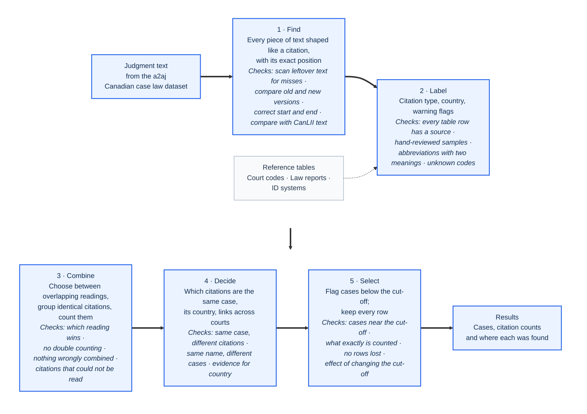
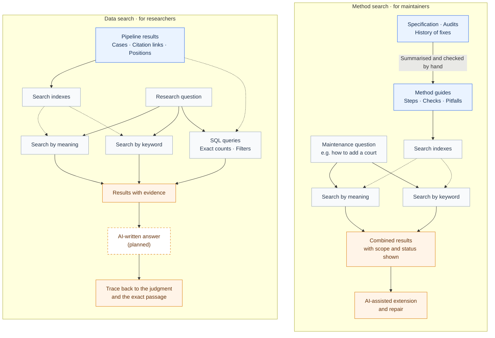

# Case Citation Pipeline

[](https://doi.org/10.5281/zenodo.23149206)

[](LICENSE)
[](https://huggingface.co/datasets/a2aj/canadian-case-law)


A method for turning any collection of court judgments into a citation network you can check: find every case citation in the text, work out which case each one points to, and count how many different judgments cite that case. Every number can be traced back to a judgment and the exact character position in its text.

Which courts to run is a setting. The method works on any court in the public [a2aj Canadian case law dataset](https://huggingface.co/datasets/a2aj/canadian-case-law). So far it has been run end to end on three courts — the Supreme Court of Canada (SCC), the Court of Appeal for Ontario (ONCA) and the Court of Appeal for British Columbia (BCCA) — and checked against [CanLII](https://www.canlii.org), Canada's free case-law website, which publishes its own lists of cited cases.

On top of the results sit two search systems (RAG, "retrieval-augmented generation": search that finds relevant passages so a person or an AI model can answer from them). One answers research questions about the cases; the other searches the project's own methods, so the pipeline can be extended to new courts and citation styles.

| | |
| --- | --- |
| **The problem** | To know which cases a court actually relies on, foreign or domestic, you have to count citations across its whole history. But judgments print the same case in many forms: the court's own case number (a "neutral citation", e.g. `2002 SCC 33`), references to one or more printed law reports (e.g. `[2002] 2 S.C.R. 235`), database IDs, and 19th-century footnote styles. A fixed list of abbreviations misses most of them. |
| **The approach** | Five steps, each passing its results forward only: (1) find every piece of text shaped like a citation; (2) label each one using reference tables, where every row names the printed source it was taken from; (3) combine identical citations; (4) decide which different citations are the same case; (5) count citing judgments and apply a cut-off. Rows are flagged, never deleted. |
| **What you get** | CSV tables for each step (candidate citations, labelled rows, cases, and links from each judgment to each case it cites), plus a SQLite results database with two search systems: keyword and meaning-based search over the cases, for research; and over the project's code, audits and method guides, for maintenance. See [the example](#example-one-paragraph-through-two-steps) and [Two search systems](#two-search-systems-rag-on-top-of-the-pipeline). |
| **Stack** | Python 3.11, the standard library plus `pyarrow` and `PyYAML`. Search uses SQLite full-text search, `sqlite-vec` and OpenRouter embeddings. |
| **How well it works** | 215 citation links from 360 judgments checked by hand against CanLII: 87.0% are real case citations (likely between 75% and 92%), rising to 98.9–100% for cases cited by five or more judgments. About 880 automated checks pass locally; the demo and the step tests also run automatically on GitHub. See [How well it works](#how-well-it-works). |
| **Scope** | Courts are chosen with the `PIPELINE_COURTS` setting. A new court needs its data file and, where it uses law reports or court codes the reference tables do not know yet, new table rows; [`docs/method_cards/00_new_court_playbook.md`](docs/method_cards/00_new_court_playbook.md) lists the steps. |
| **Run it** | Download the data, run `pipeline/run_all.py`. The current three-court run took 37 minutes and wrote 3.1 GB. See [Quick start](#quick-start). |

> This is research data, not legal advice. Read [`docs/USAGE.md`](docs/USAGE.md) before quoting any number: it defines exactly what "cited N times" counts and lists where the tables under-count.

## Example: one paragraph through two steps

`scripts/demo.py` runs the first two steps (find and label) on a made-up paragraph. It needs no downloaded data and no internet:

```text
[12] The standard of review was settled in Housen v. Nikolaisen, 2002 SCC 33, [2002] 2 S.C.R. 235.
The English rule in Donoghue v. Stevenson, [1932] A.C. 562 (H.L.), was applied. See also R. v. Oakes,
[1986] 1 S.C.R. 103, and section 7 of the Act, R.S.C. 1985, c. C-46.
```

```console
$ python scripts/demo.py
raw_string            shape                 offset   kind       jurisdiction  parse_status         court
2002 SCC 33           neutral_bare          65       neutral    CA            valid                -
2002 SCC 33           vol_abbr_page         65       reporter   UNSUPPORTED   ambiguous_year_vol   -
[2002] 2 S.C.R. 235   bracket               78       reporter   CA            valid                -
2 S.C.R. 235          vol_abbr_page         85       reporter   CA            valid                -
[1932] A.C. 562       bracket               142      reporter   GB            valid                H.L.
[1986] 1 S.C.R. 103   bracket               201      reporter   CA            valid                -
1 S.C.R. 103          vol_abbr_page         208      reporter   CA            valid                -
```

How to read this:

- `shape` is the text pattern that matched; `offset` is the character position where the citation starts.
- `kind`: `neutral` is the court's own case number (like `2002 SCC 33`); `reporter` is a reference to a printed law report (volume, report name, page, like `[2002] 2 S.C.R. 235`).
- `jurisdiction` is the country of the court (`CA` Canada, `GB` United Kingdom). `UNSUPPORTED` means "unknown": the tool does not guess.
- `parse_status` says whether the citation reads cleanly (`valid`) or is doubtful.
- The find step keeps every possible reading of the text, so `2002 SCC 33` appears twice: once correctly, as a neutral citation, and once misread as volume 2002 of a law report called `SCC`, which the label step marks as doubtful (`ambiguous_year_vol`). The combine step chooses between overlapping readings later.
- `[2002] 2 S.C.R. 235` and `2 S.C.R. 235` are the same reference matched twice (with and without the year); it is counted once later.
- `(H.L.)` (House of Lords) is recorded as the court that decided the English case.
- The statute reference at the end is correctly *not* picked up as a case citation.

### What the full pipeline makes possible

The two steps above only find and label pieces of text. The later steps decide which pieces are the same case and count how many different judgments cite it. In the tables this count is called **DD** ("distinct decisions"): a judgment that cites a case twenty times counts once.

Once every citation in a court's history is matched to a case, questions that used to need years of reading become a query. One we have not seen measured at this scale: which foreign judgments have Canadian courts actually relied on, and how much? The table below is the start of that answer, from run `run_20261003_v16f` over SCC, ONCA and BCCA:

| Cited by (DD) | Case | Citation | Origin |
| ---: | --- | --- | --- |
| 108 | Donoghue v. Stevenson | [1932] A.C. 562 | GB (United Kingdom) |
| 52 | Salomon v. Salomon & Co | [1897] A.C. 22 | GB (United Kingdom) |
| 43 | Makin v. Attorney-General for New South Wales | [1894] A.C. 57 | AU (Australia) |
| 41 | Ibrahim v. The King | [1914] A.C. 599 | HK (Hong Kong) |
| 17 | Hedley Byrne & Co Ltd v Heller & Partners Ltd | [1964] A.C. 465 | GB (United Kingdom) |

Origin is the country of the court where the cited case came from. Makin and Ibrahim were decided in London by the Privy Council, which heard appeals from across the British Empire, so they appear in an English law report but originate in Australia and Hong Kong. Origin is set only when the citation itself or a verified reference table proves it. In this run 63,436 of 233,385 cases (27%) have a proven origin, so these counts are a minimum; widening that coverage is ongoing work. The same tables can be broken down by court and decade to follow how reliance on English, Australian or other foreign law changed over time.

## Pipeline



1. **Find:** match text patterns shaped like citations (year, court code, volume and page) and keep every match with its position. No fixed list of abbreviations is needed.
2. **Label:** row by row, look up the country in the reference tables, separate out possible case names, and flag things that only look like citations and judgments citing themselves.
3. **Combine:** work across all rows. Where the same text can be read two ways, choose one; collapse identical citations into one; fold together small variations in how a citation is written; pick each case's name by majority vote.
4. **Decide:** settle which citations are the same case. Join the different law-report references printed side by side for one case, link the same case across courts, split apart different cases that share a name, and determine the country of origin.
5. **Select:** apply one cut-off on DD (the number of different citing judgments). Cases below it are flagged, not removed.

Each step fixes only the problems it creates itself, and no step ever reads the output of a later step. Every row in the reference tables in [`decisions/`](decisions/) is based on something actually printed in judgments and records where it was found. If a lookup finds nothing, the answer is `UNSUPPORTED` ("unknown") rather than a guess.

### Data

The judgments come from the [`a2aj/canadian-case-law`](https://huggingface.co/datasets/a2aj/canadian-case-law) dataset on Hugging Face. This project does not collect them itself.

| Court | Judgments | Years |
| --- | ---: | --- |
| Supreme Court of Canada (SCC) | 10,891 | 1877–2026 |
| Court of Appeal for Ontario (ONCA) | 24,089 | 1998–2026 |
| Court of Appeal for British Columbia (BCCA) | 14,703 | 1999–2026 |

Trial courts, other appeal courts, federal courts and tribunals are not included yet. The list of courts is set by `PIPELINE_COURTS`. A trial run on the Canadian International Trade Tribunal could determine the country for only 28.4% of rows, because its citations are mostly tariff items and specialist law reports the tables do not cover yet ([findings](implementation/exp_bcca_citt_findings.md)).

Most recent full run, `run_20261003_v16f` (code version `f7f3951`, before the labelling fixes in `d5f54e9` and `fe8c66c`). The first number is much larger than the rest because it counts every match, including repeated mentions and the duplicate readings shown in the example:

| | |
| --- | ---: |
| Possible citations found | 1,469,878 |
| Citation rows after combining | 260,413 |
| Distinct cases | 233,385 |
| Links from a citing judgment to a cited case | 489,220 |
| Cases cited by 5 or more judgments | 13,610 |

## Two search systems (RAG) on top of the pipeline

The pipeline produces two things: structured results (cases, counts, and citation links with their exact positions) and a large written record of how each step was built, checked and repaired. Both are turned into searchable collections, shown below. The data side serves people asking research questions about the results. The method side serves whoever maintains or extends the pipeline, so that adding a court or a new citation pattern starts from what already worked and what already failed.



The dashed box is not built yet: search returns ranked results with their source passages, but no AI model writes an answer from them yet. Everything else in the diagram is in [`tools/foundation/`](tools/foundation/README.md) and runs with one command after each pipeline run.

### Data search

[`after_run.py`](tools/foundation/after_run.py) loads a run into a local SQLite database (`data/foundation/research.db`, about 2.8 GB for three courts; you build it from your own run, it is not shipped). It holds the judgments, the cases, the citation texts, the citation links with labels for how a case is used, and weights calibrated against CanLII. Exact counts and filters are SQL queries over these tables.

For search, every case that has a name or is cited by at least two judgments gets one profile: its name, its citations, its DD, and 2 to 4 of the most readable passages from judgments that cite it (330 characters before the citation and 120 after) ([`index_cases.py`](tools/foundation/index_cases.py)). Every result links back to its run and judgment:

```console
$ python tools/foundation/query.py "Donoghue" --mode keyword -k 1
1.
  Donoghue v. Stevenson  [XC-G002421]
    citations: [1932] A.C. 562
    DD 108  weighted DD 106.2 (confidence 0.98, experimental)  origin FOREIGN GB
    cited by (latest 5 of 108): ONCA_2025onca452 Price v. Smith & Wesson Corporation (2025-06-23); BCCA_2024bcca323 Bevan v. Husak (2024-09-12); …
    trace:  python pipeline/trace_source.py --run-dir data/run_20261003_selfcite --search "Donoghue v. Stevenson"
```

How to read this: `[XC-G002421]` is the case's ID in our tables. `DD 108` means 108 different judgments cite it. `weighted DD` discounts each citation by how likely it is to be real, based on the CanLII check (still experimental); `confidence` is how sure that estimate is. `origin FOREIGN GB` means a foreign case from the United Kingdom. The `trace` line is a command that prints every citing passage from the original text.

### Method search

[`index_methods.py`](tools/foundation/index_methods.py) splits the project's own material into about 1,100 records. Each is tagged with the pipeline step it belongs to and its status, and pinned to a file and line number at a specific code version. The records are: every function and class in `pipeline/` (read with Python's `ast` parser), every reference table, every section of the specification and the audit reports, and the hand-written [method guides](docs/method_cards/) (what each step does, what to change for a new court, how to verify it, known pitfalls). Method searches always reserve the top two places for method guides, so a question about extending the pipeline lands on the hand-written answer first. The question "how to add a new court" returned the new-court guide among the top three results; that was measured when the guides were still in Chinese, so rebuild the index after pulling to re-check it on the English guides.

### Indexing and embedding

After each pipeline run, `after_run.py` imports the run, computes the weights, rebuilds both collections and turns their text into embeddings (numeric vectors that capture meaning) with [`embed.py`](tools/foundation/embed.py): model `qwen/qwen3-embedding-8b` via OpenRouter, 1,024 dimensions, one `sqlite-vec` table per collection. Embeddings are cached by a hash of the text, so a new run only pays for text that changed. [`query.py`](tools/foundation/query.py) merges the keyword ranking (SQLite full-text search) and the meaning ranking with reciprocal-rank fusion, a standard way of combining two ranked lists. Statistics always come from SQL over the full tables, never from the top search results.

## How well it works

All accuracy figures come from comparing run `run_20261002_tables2` with CanLII's own citation lists for 360 judgments, sampled across the three courts and three time periods each ([`audit/findings/canlii_crosscheck/`](audit/findings/canlii_crosscheck/)).

**Are the citation links real?** We checked 215 of our links by reading the source text. Weighted up to the full set, 87.0% are real case citations (allowing for sampling error, likely between 75% and 92%), 8.2% are not cases at all (journal articles, statute sections, tables of contents) and 4.8% point to an earlier stage of the same case. Accuracy rises with how many judgments cite the case:

| Case is cited by (DD) | Real case citations |
| --- | ---: |
| 1 judgment | 75.0% |
| 2–4 judgments | 81.7% |
| 5–9 judgments | 98.9% |
| 10 or more | 100% |

**Do we miss citations?** For the 40 sampled SCC judgments from 2000–2026, we find 97.3% of the cited cases CanLII lists for them. Coverage falls for older judgments: 79.8% for SCC 1950–1999 and 36.4% for SCC 1875–1949. For that oldest period we examined the 68 cases that only CanLII lists: none turned out to be a citation we had missed in the judgment text, and 63 of them could not be found in the text by name at all, so part of the gap may be on CanLII's side ([t2 summary](audit/findings/canlii_crosscheck/run_20261002_tables2/t2_summary.md)). The ONCA and BCCA samples range from 70.2% (ONCA 1998–2006) to 96.9% (ONCA 2016–2026).

**Are the "cited by" lists right?** For 61 sampled cited cases, the judgments we list as citing them are also on CanLII's list 98.5–99.8% of the time, and we find 82.7% (cases before 1950) to 99.5% (cases after 2000) of the citing judgments CanLII lists within the same three courts.

These measurements were made before version 1.6 of the find step and the latest labelling fixes, and have not yet been repeated on `run_20261003_v16f`. The cut-off of DD 5 used by the select step is a working value that has not been calibrated.

The test scripts `test_layers.py` (172 checks), `test_candidates.py` (378), `test_non_citation_words.py` (167), `test_registered_id.py` (87), `test_shape_21.py` (76) and the find-step regression self-test all pass locally. The demo and the step tests also run automatically on GitHub on every push (Python 3.11–3.14, Linux and Windows). The remaining tests read the downloaded data and earlier run outputs, which are too large for the repository, so they run only locally.

Every problem found so far is recorded in [`PROBLEMS.md`](PROBLEMS.md), with its measured size, cause, fix and effect; [`DEBT_LEDGER.md`](DEBT_LEDGER.md) tracks the remaining technical debt.

## Quick start

You need Python 3.11 or later, `bash` (Git Bash or WSL on Windows) for the download script, and about 5 GB of free disk space (1.4 GB of judgments plus 3.1 GB per run).

```bash
pip install pyarrow pyyaml
bash scripts/download_corpus.sh list       # show what will be downloaded
bash scripts/download_corpus.sh download   # save the judgments as Parquet files in corpus/
```

By default this downloads SCC, ONCA and BCCA. To get other courts from the same dataset, name them: `PIPELINE_COURTS=SCC,CITT bash scripts/download_corpus.sh download`. Use the same setting when running the pipeline.

```bash
python scripts/demo.py                                        # the offline example above, no download needed
python pipeline/run_all.py --out data/run_smoke --limit-batches 1   # quick test, one batch per court
python pipeline/run_all.py --out data/run_YYYYMMDD_name             # full run
```

To build the results database and search indexes, install `sqlite-vec` and put an OpenRouter key in the file named in [`tools/foundation/README.md`](tools/foundation/README.md):

```bash
python tools/foundation/after_run.py --run data/run_YYYYMMDD_name
```

After changing any step, run the checks:

```bash
python pipeline/tests/run_regression.py --selftest
python pipeline/tests/test_layers.py
python pipeline/tests/test_layers.py --golden
```

The full order of steps is in §12 of the [technical specification](docs/technical_specification.md). Changes that go beyond the specification are recorded in `PROBLEMS.md`.

## Roadmap

From the project's own open items:

- Calibrate the DD cut-off, which is still a working value.
- Re-measure accuracy against CanLII on the current run.
- Resolve the open entries in `PROBLEMS.md`, such as the court label `(F.C.A.)`, used by both Canada's and Australia's Federal Court (#99), and inconsistent BCCA judgment headers (#110).
- Decide whether to build meaning-based search for individual citation passages (keyword search over them already exists).
- Generate research answers from search results, with source references.
- Add more courts and tribunals, starting from the guide in `docs/method_cards/00_new_court_playbook.md`.

## License

The code is released under the [MIT License](LICENSE). The judgments themselves come from the [a2aj/canadian-case-law](https://huggingface.co/datasets/a2aj/canadian-case-law) dataset and are covered by its own terms, not by this license.
