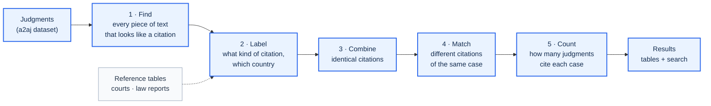
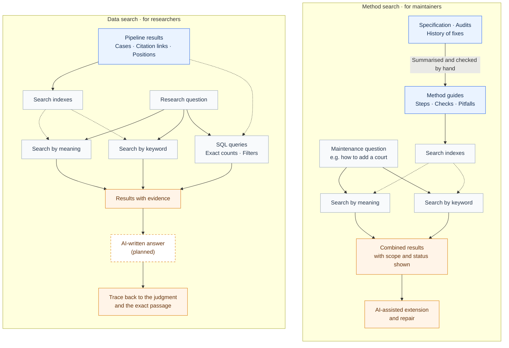

# Case Citation Pipeline

[](https://doi.org/10.5281/zenodo.23149206)

[](LICENSE)
[](https://huggingface.co/datasets/a2aj/canadian-case-law)


Courts constantly cite earlier cases. This project reads every published judgment of a court, finds each case it cites, and counts how many different judgments rely on each case. The result is a citation network you can check: every number traces back to a specific judgment and the exact place in its text.

It has been run on three Canadian courts — the Supreme Court of Canada (SCC), the Court of Appeal for Ontario (ONCA) and the Court of Appeal for British Columbia (BCCA) — using the public [a2aj Canadian case law dataset](https://huggingface.co/datasets/a2aj/canadian-case-law), and checked against [CanLII](https://www.canlii.org), Canada's free case-law website. Other courts can be added by changing a setting.

| | |
| --- | --- |
| **The problem** | The same case is written in many different ways — the court's own case number (`2002 SCC 33`), law-report references (`[2002] 2 S.C.R. 235`), database IDs, old footnote styles — so a simple list of abbreviations misses most citations. |
| **The approach** | Five steps: find anything shaped like a citation, label it, combine duplicates, decide which citations are the same case, and count. Nothing is ever deleted, only flagged, and every lookup rule records where it came from. |
| **What you get** | Tables of every citation and every cited case, plus two search tools: one for researchers to explore the cases, one for maintainers to find how the pipeline works. |
| **How accurate** | About 87% of citation links are real case citations; for cases cited by five or more different judgments (the kept result), 99–100%. See [What the final data looks like](#what-the-final-data-looks-like). |

> This is research data, not legal advice. Read [`docs/USAGE.md`](docs/USAGE.md) before quoting any number: it defines exactly what "cited N times" counts and lists where the tables under-count.

## What the final data looks like

The pipeline's output is a list of cases, each with one key number, its DD. **DD** ("distinct decisions") is the number of different judgments that cite a case; a judgment that cites the same case twenty times counts once.

Every case found stays in the tables, whatever its DD. The select step then sorts them with one cut-off, currently **DD ≥ 5**:

| DD | Meaning | Share of real case citations (checked against CanLII) | In the latest run |
| --- | --- | ---: | --- |
| **5 or more** | Kept: the main result. Cited by at least five different judgments. | 98.9% (5–9) to 100% (10 or more) | 13,610 of 233,385 cases |
| **2 to 4** | Below the cut-off: flagged, not deleted. Cited by a few judgments; mostly real, but more noise and mistakes get through. | 81.7% | 219,775 cases with DD 1–4 together |
| **1** | Below the cut-off: flagged, not deleted. Cited by a single judgment; a quarter of these links are not real case citations. | 75.0% | (included in the 219,775) |

So a high DD means the case is both reliably identified and widely relied on, while a low DD means either a rarely cited case or a citation that may be a mistake. Nothing is removed, so you can lower the cut-off and look at the flagged cases yourself. The cut-off of 5 is a working value that has not been formally calibrated. Where these accuracy numbers come from is explained in [How well it works](#how-well-it-works).

## Example: one paragraph through two steps

`scripts/demo.py` runs the first two steps (find and label) on a made-up paragraph. It needs no downloaded data and no internet:

```text
[12] The standard of review was settled in Housen v. Nikolaisen, 2002 SCC 33, [2002] 2 S.C.R. 235.
The English rule in Donoghue v. Stevenson, [1932] A.C. 562 (H.L.), was applied. See also R. v. Oakes,
[1986] 1 S.C.R. 103, and section 7 of the Act, R.S.C. 1985, c. C-46.
```

```console
$ python scripts/demo.py
raw_string            shape                 offset   kind       jurisdiction  parse_status         court
2002 SCC 33           neutral_bare          65       neutral    CA            valid                -
2002 SCC 33           vol_abbr_page         65       reporter   UNSUPPORTED   ambiguous_year_vol   -
[2002] 2 S.C.R. 235   bracket               78       reporter   CA            valid                -
2 S.C.R. 235          vol_abbr_page         85       reporter   CA            valid                -
[1932] A.C. 562       bracket               142      reporter   GB            valid                H.L.
[1986] 1 S.C.R. 103   bracket               201      reporter   CA            valid                -
1 S.C.R. 103          vol_abbr_page         208      reporter   CA            valid                -
```

How to read this:

- `shape` is the text pattern that matched; `offset` is the character position where the citation starts.
- `kind`: `neutral` is the court's own case number (like `2002 SCC 33`); `reporter` is a reference to a printed law report (volume, report name, page, like `[2002] 2 S.C.R. 235`).
- `jurisdiction` is the country of the court (`CA` Canada, `GB` United Kingdom). `UNSUPPORTED` means "unknown": the tool does not guess.
- `parse_status` says whether the citation reads cleanly (`valid`) or is doubtful.
- The find step keeps every possible reading of the text, so `2002 SCC 33` appears twice: once correctly, as a neutral citation, and once misread as volume 2002 of a law report called `SCC`, which the label step marks as doubtful (`ambiguous_year_vol`). The combine step chooses between overlapping readings later.
- `[2002] 2 S.C.R. 235` and `2 S.C.R. 235` are the same reference matched twice (with and without the year); it is counted once later.
- `(H.L.)` (House of Lords) is recorded as the court that decided the English case.
- The statute reference at the end is correctly *not* picked up as a case citation.

### What the full pipeline makes possible

The two steps above only find and label pieces of text. The later steps decide which pieces are the same case and count its DD, the number of different judgments that cite it (defined [above](#what-the-final-data-looks-like)).

Once every citation in a court's history is matched to a case, questions that used to need years of reading become a query. One we have not seen measured at this scale: which foreign judgments have Canadian courts actually relied on, and how much? The table below is the start of that answer, from run `run_20261003_v16f` over SCC, ONCA and BCCA:

| Cited by (number of different judgments) | Case | Citation | Origin |
| ---: | --- | --- | --- |
| 108 | Donoghue v. Stevenson | [1932] A.C. 562 | GB (United Kingdom) |
| 52 | Salomon v. Salomon & Co | [1897] A.C. 22 | GB (United Kingdom) |
| 43 | Makin v. Attorney-General for New South Wales | [1894] A.C. 57 | AU (Australia) |
| 41 | Ibrahim v. The King | [1914] A.C. 599 | HK (Hong Kong) |
| 17 | Hedley Byrne & Co Ltd v Heller & Partners Ltd | [1964] A.C. 465 | GB (United Kingdom) |

Origin is the country of the court where the cited case came from. Makin and Ibrahim were decided in London by the Privy Council, which heard appeals from across the British Empire, so they appear in an English law report but originate in Australia and Hong Kong. Origin is set only when the citation itself or a verified reference table proves it. In this run 63,436 of 233,385 cases (27%) have a proven origin, so these counts are a minimum; widening that coverage is ongoing work. The same tables can be broken down by court and decade to follow how reliance on English, Australian or other foreign law changed over time.

## Pipeline



1. **Find** anything shaped like a citation (year, court code, volume, page). No abbreviation list is needed, so unfamiliar reports are still caught.
2. **Label** each one: what kind of citation, which country, and whether it is only a look-alike or a judgment citing itself.
3. **Combine** identical citations and resolve text that could be read two ways.
4. **Decide** which different citations are the same case — for example a case number and a law-report reference printed side by side — and keep apart different cases with the same name.
5. **Select** by DD (the number of different judgments citing each case). Cases with DD of 5 or more are kept as the main result; cases with DD 1–4 are flagged as below the cut-off, not removed.

Each step only fixes its own mistakes and never depends on a later step, so a problem can always be traced to where it started. The [reference tables](decisions/) contain only facts actually printed in judgments, each with its source; when a lookup finds nothing, the answer is "unknown" rather than a guess.

### Data

The judgments come from the [`a2aj/canadian-case-law`](https://huggingface.co/datasets/a2aj/canadian-case-law) dataset on Hugging Face. This project does not collect them itself.

| Court | Judgments | Years |
| --- | ---: | --- |
| Supreme Court of Canada (SCC) | 10,891 | 1877–2026 |
| Court of Appeal for Ontario (ONCA) | 24,089 | 1998–2026 |
| Court of Appeal for British Columbia (BCCA) | 14,703 | 1999–2026 |

Trial courts, other appeal courts, federal courts and tribunals are not included yet. The list of courts is set by `PIPELINE_COURTS`. A trial run on the Canadian International Trade Tribunal could determine the country for only 28.4% of rows, because its citations are mostly tariff items and specialist law reports the tables do not cover yet ([findings](implementation/exp_bcca_citt_findings.md)).

Size of the latest full run (`run_20261003_v16f`). The first number is much larger than the rest because it counts every match, including repeated mentions and duplicate readings:

| | |
| --- | ---: |
| Possible citations found | 1,469,878 |
| Citation rows after combining | 260,413 |
| Distinct cases | 233,385 |
| Links from a citing judgment to a cited case | 489,220 |
| Cases cited by 5 or more judgments | 13,610 |

## Two search systems (RAG) on top of the pipeline

The pipeline produces two things: the results themselves, and a detailed record of how each step was built, checked and fixed. Both are made searchable. Researchers search the results; maintainers search the record, so adding a new court starts from what already worked and what already failed.



The dashed box is not built yet: search returns ranked results with their source passages, but no AI model writes an answer from them yet. Everything else in the diagram is in [`tools/foundation/`](tools/foundation/README.md) and runs with one command after each pipeline run.

### Data search

After each run, the results are loaded into a local database. Every frequently cited case gets a short profile — its name, its citations, how many judgments cite it, and a few passages where it is cited — and these profiles are indexed for both keyword search and search by meaning. The effect: you can type a case name or a legal idea, get the matching cases ranked, see who cites them, and jump straight to the passage in the original judgment. Exact numbers always come from the full tables, not from search results.

```console
$ python tools/foundation/query.py "Donoghue" --mode keyword -k 1
1.
  Donoghue v. Stevenson  [XC-G002421]
    citations: [1932] A.C. 562
    DD 108  weighted DD 106.2 (confidence 0.98, experimental)  origin FOREIGN GB
    cited by (latest 5 of 108): ONCA_2025onca452 Price v. Smith & Wesson Corporation (2025-06-23); BCCA_2024bcca323 Bevan v. Husak (2024-09-12); …
    trace:  python pipeline/trace_source.py --run-dir data/run_20261003_selfcite --search "Donoghue v. Stevenson"
```

`DD 108` means 108 different judgments cite this case; `weighted DD` is an experimental estimate of how many of those are real, based on the CanLII check. The `trace` line prints every citing passage from the original text.

### Method search

The project's own material — the code, the reference tables, the specification, the audit reports and a set of hand-written method guides — is split into small pieces, each labelled with the step it belongs to and linked to the exact file and line. A maintainer can ask a question such as "how do I add a new court?" and gets the hand-written guide first, followed by the relevant code and past problems. The effect: extending the pipeline starts from what already worked and what already failed, instead of from scratch.

Both searches are rebuilt automatically after each run with one command ([`after_run.py`](tools/foundation/after_run.py)). Search by meaning uses text embeddings from OpenRouter; only changed text is re-processed, so updates are cheap.

## How well it works

All accuracy figures come from comparing run `run_20261002_tables2` with CanLII's own citation lists for 360 judgments, sampled across the three courts and three time periods each ([`audit/findings/canlii_crosscheck/`](audit/findings/canlii_crosscheck/)).

**Are the citation links real?** We checked 215 of our links by reading the source text. Weighted up to the full set, 87.0% are real case citations (allowing for sampling error, likely between 75% and 92%), 8.2% are not cases at all (journal articles, statute sections, tables of contents) and 4.8% point to an earlier stage of the same case. Accuracy rises with a case's DD. **DD** ("distinct decisions") is the number of different judgments that cite a case; a judgment that cites the same case twenty times counts once.

| DD | Real case citations |
| --- | ---: |
| 1 | 75.0% |
| 2–4 | 81.7% |
| 5–9 | 98.9% |
| 10 or more | 100% |

This is why the cut-off sits at 5: below it a case may be rare or a mistake, above it nearly every citation checked was real.

**Do we miss citations?** For the 40 sampled SCC judgments from 2000–2026, we find 97.3% of the cited cases CanLII lists for them. Coverage falls for older judgments: 79.8% for SCC 1950–1999 and 36.4% for SCC 1875–1949. For that oldest period we examined the 68 cases that only CanLII lists: none turned out to be a citation we had missed in the judgment text, and 63 of them could not be found in the text by name at all, so part of the gap may be on CanLII's side ([t2 summary](audit/findings/canlii_crosscheck/run_20261002_tables2/t2_summary.md)). The ONCA and BCCA samples range from 70.2% (ONCA 1998–2006) to 96.9% (ONCA 2016–2026).

**Are the "cited by" lists right?** For 61 sampled cited cases, the judgments we list as citing them are also on CanLII's list 98.5–99.8% of the time, and we find 82.7% (cases before 1950) to 99.5% (cases after 2000) of the citing judgments CanLII lists within the same three courts.

These measurements were made before version 1.6 of the find step and the latest labelling fixes, and have not yet been repeated on `run_20261003_v16f`. The select-step cut-off of DD 5 is a working value that has not been calibrated.

About 880 automated checks pass locally. The demo and the step tests also run on GitHub on every push (Python 3.11–3.14, Linux and Windows); the rest need the full downloaded data and run only locally.

Every problem found so far is recorded in [`PROBLEMS.md`](PROBLEMS.md), with its measured size, cause, fix and effect; [`DEBT_LEDGER.md`](DEBT_LEDGER.md) tracks the remaining technical debt.

## Quick start

You need Python 3.11 or later, `bash` (Git Bash or WSL on Windows) for the download script, and about 5 GB of free disk space (1.4 GB of judgments plus 3.1 GB per run).

```bash
pip install pyarrow pyyaml
bash scripts/download_corpus.sh list       # show what will be downloaded
bash scripts/download_corpus.sh download   # save the judgments as Parquet files in corpus/
```

By default this downloads SCC, ONCA and BCCA. To get other courts from the same dataset, name them: `PIPELINE_COURTS=SCC,CITT bash scripts/download_corpus.sh download`. Use the same setting when running the pipeline.

```bash
python scripts/demo.py                                        # the offline example above, no download needed
python pipeline/run_all.py --out data/run_smoke --limit-batches 1   # quick test, one batch per court
python pipeline/run_all.py --out data/run_YYYYMMDD_name             # full run
```

To build the results database and search indexes, install `sqlite-vec` and put an OpenRouter key in the file named in [`tools/foundation/README.md`](tools/foundation/README.md):

```bash
python tools/foundation/after_run.py --run data/run_YYYYMMDD_name
```

After changing any step, run the checks:

```bash
python pipeline/tests/run_regression.py --selftest
python pipeline/tests/test_layers.py
python pipeline/tests/test_layers.py --golden
```

The full order of steps is in §12 of the [technical specification](docs/technical_specification.md). Changes that go beyond the specification are recorded in `PROBLEMS.md`.

## Roadmap

From the project's own open items:

- Calibrate the DD cut-off, which is still a working value.
- Re-measure accuracy against CanLII on the current run.
- Resolve the open entries in `PROBLEMS.md`, such as the court label `(F.C.A.)`, used by both Canada's and Australia's Federal Court (#99), and inconsistent BCCA judgment headers (#110).
- Decide whether to build meaning-based search for individual citation passages (keyword search over them already exists).
- Generate research answers from search results, with source references.
- Add more courts and tribunals, starting from the guide in `docs/method_cards/00_new_court_playbook.md`.

## License

The code is released under the [MIT License](LICENSE). The judgments themselves come from the [a2aj/canadian-case-law](https://huggingface.co/datasets/a2aj/canadian-case-law) dataset and are covered by its own terms, not by this license.
