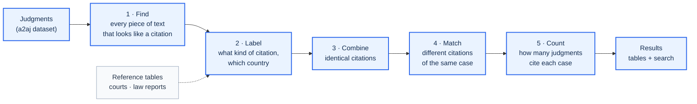
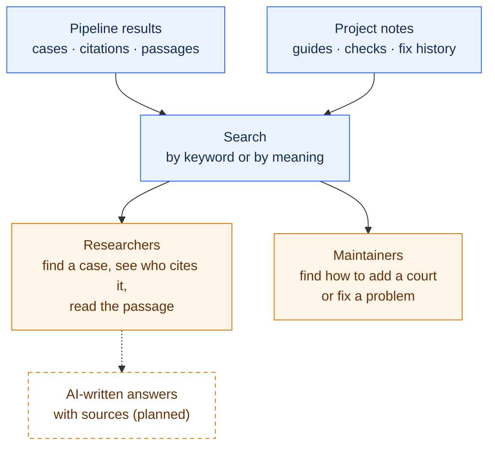

# Case Citation Pipeline

[](https://doi.org/10.5281/zenodo.23149206)

[](LICENSE)
[](https://huggingface.co/datasets/a2aj/canadian-case-law)


This project reads every judgment a court has published and works out which earlier cases it cites. It finds each case citation in the text, figures out which case it refers to, and counts how many different judgments cite that case. Every number can be traced back to the judgment and the exact place in the text it came from.

It currently runs on three Canadian courts — the Supreme Court of Canada (SCC), the Court of Appeal for Ontario (ONCA) and the Court of Appeal for British Columbia (BCCA) — using the public [a2aj Canadian case law dataset](https://huggingface.co/datasets/a2aj/canadian-case-law), and its results have been checked against CanLII. Other courts in the dataset can be added.

| | |
| --- | --- |
| **Why it is hard** | The same case is written in many ways: the court's own number (`2002 SCC 33`), one or more law-report references (`[2002] 2 S.C.R. 235`), database IDs, and older footnote styles. A fixed list of abbreviations misses most of them. |
| **What you get** | Spreadsheet-style tables (CSV) of every citation found and every case cited, plus a searchable database where you can look up a case, see who cites it, and jump to the quoted passage. |
| **How accurate** | Checked by hand against CanLII: about 87% of the citations found are real case citations. For cases cited by five or more judgments, it is 99–100%. See [How well it works](#how-well-it-works). |

> This is research data, not legal advice. Read [`docs/USAGE.md`](docs/USAGE.md) before quoting any number: it explains exactly what "cited by N judgments" counts and where the tables under-count.

## Example

`scripts/demo.py` runs the first two steps on a made-up paragraph. It needs no downloads and no internet:

```text
[12] The standard of review was settled in Housen v. Nikolaisen, 2002 SCC 33, [2002] 2 S.C.R. 235.
The English rule in Donoghue v. Stevenson, [1932] A.C. 562 (H.L.), was applied. See also R. v. Oakes,
[1986] 1 S.C.R. 103, and section 7 of the Act, R.S.C. 1985, c. C-46.
```

```console
$ python scripts/demo.py
raw_string            shape                 offset   kind       jurisdiction  parse_status         court
2002 SCC 33           neutral_bare          65       neutral    CA            valid                -
2002 SCC 33           vol_abbr_page         65       reporter   UNSUPPORTED   ambiguous_year_vol   -
[2002] 2 S.C.R. 235   bracket               78       reporter   CA            valid                -
2 S.C.R. 235          vol_abbr_page         85       reporter   CA            valid                -
[1932] A.C. 562       bracket               142      reporter   GB            valid                H.L.
[1986] 1 S.C.R. 103   bracket               201      reporter   CA            valid                -
1 S.C.R. 103          vol_abbr_page         208      reporter   CA            valid                -
```

How to read this:

- `offset` is the character position in the paragraph where the citation starts.
- `jurisdiction` is the country of the court (`CA` Canada, `GB` United Kingdom). `UNSUPPORTED` means "unknown" — the tool does not guess.
- `2002 SCC 33` shows up twice because the first step keeps every possible reading. One reading is correct (the Supreme Court's own case number); the other mistakes it for volume 2002 of a law report called "SCC", and is flagged as doubtful. A later step picks the right one.
- `(H.L.)` (House of Lords) is recorded as the court that decided the English case.
- The statute reference at the end is correctly *not* treated as a case.

### What this makes possible

Once every citation in a court's history is matched to a case, questions that used to take years of reading become a simple lookup. For example: which foreign judgments have Canadian courts relied on most? Here are the top five across SCC, ONCA and BCCA:

| Cited by (judgments) | Case | Citation | Country of origin |
| ---: | --- | --- | --- |
| 108 | Donoghue v. Stevenson | [1932] A.C. 562 | United Kingdom |
| 52 | Salomon v. Salomon & Co | [1897] A.C. 22 | United Kingdom |
| 43 | Makin v. Attorney-General for New South Wales | [1894] A.C. 57 | Australia |
| 41 | Ibrahim v. The King | [1914] A.C. 599 | Hong Kong |
| 17 | Hedley Byrne & Co Ltd v Heller & Partners Ltd | [1964] A.C. 465 | United Kingdom |

"Cited by" counts *different* judgments: a judgment that mentions a case twenty times counts once. Country of origin is filled in only when the citation itself proves it, so for now it is known for about a quarter of all cases (63,436 of 233,385), and these counts are a minimum. The same tables can be broken down by court and decade to see how reliance on English, Australian or other foreign law has changed over time.

## How it works



1. **Find.** Look for text with the shape of a citation (a year, a court code, a volume and page). Keep every match and its position. No fixed list of abbreviations is needed.
2. **Label.** For each match, decide what kind of citation it is and which country's court it comes from, using reference tables of courts and law reports. Flag things that only look like citations, and judgments citing themselves.
3. **Combine.** When the same text could be read two ways, keep the right reading. Treat identical citations as one, and pick the most common case name for each.
4. **Match.** Work out which different citations point to the same case (for example a court number and a law-report reference printed side by side), and keep apart different cases that happen to share a name.
5. **Count.** Count how many different judgments cite each case. Cases below the threshold (currently five judgments) are flagged, never deleted.

Each step only passes results forward; nothing is ever silently removed. Every row in the [reference tables](decisions/) comes with the source it was taken from. If a lookup finds nothing, the answer is "unknown" rather than a guess.

### Data

The judgments come from the [`a2aj/canadian-case-law`](https://huggingface.co/datasets/a2aj/canadian-case-law) dataset on Hugging Face. This project does not collect them itself.

| Court | Judgments | Years |
| --- | ---: | --- |
| Supreme Court of Canada (SCC) | 10,891 | 1877–2026 |
| Court of Appeal for Ontario (ONCA) | 24,089 | 1998–2026 |
| Court of Appeal for British Columbia (BCCA) | 14,703 | 1999–2026 |

Trial courts, other appeal courts, federal courts and tribunals are not included yet. Which courts to run is a setting (`PIPELINE_COURTS`). A trial run on the Canadian International Trade Tribunal could place only 28% of its citations, because it mostly cites tariff items and specialist reports our tables do not cover yet ([findings](implementation/exp_bcca_citt_findings.md)).

Size of the latest full run:

| | |
| --- | ---: |
| Possible citations found | 1,469,878 |
| Distinct citations after combining | 260,413 |
| Distinct cases | 233,385 |
| Links from a judgment to a case it cites | 489,220 |
| Cases cited by 5 or more judgments | 13,610 |

## Searching the results

After each run, one command builds a searchable database on top of the results. There are two kinds of search: one over the **cases**, for researchers, and one over the **project's own documentation**, for whoever maintains or extends it.



The dashed box is not built yet: today, search returns the matching cases with their source passages, but no AI writes an answer from them. Everything else is in [`tools/foundation/`](tools/foundation/README.md).

### Searching cases

[`after_run.py`](tools/foundation/after_run.py) loads a run into a local database (`data/foundation/research.db`, about 2.8 GB for three courts; you build it from your own run). It holds the judgments, the cases, every citation and short passages around them. Exact counts and filters are plain SQL queries. Every search result links back to the judgment it came from:

```console
$ python tools/foundation/query.py "Donoghue" --mode keyword -k 1
1.
  Donoghue v. Stevenson  [XC-G002421]
    citations: [1932] A.C. 562
    DD 108  weighted DD 106.2 (confidence 0.98, experimental)  origin FOREIGN GB
    cited by (latest 5 of 108): ONCA_2025onca452 Price v. Smith & Wesson Corporation (2025-06-23); BCCA_2024bcca323 Bevan v. Husak (2024-09-12); …
    trace:  python pipeline/trace_source.py --run-dir data/run_20261003_selfcite --search "Donoghue v. Stevenson"
```

In this output, `DD` is the number of different judgments citing the case. `weighted DD` adjusts that number using our accuracy check against CanLII, giving an estimate of how many of those citations are real (still experimental). The `trace` line is a command that shows each citing passage in the original text.

### Searching the project's documentation

[`index_methods.py`](tools/foundation/index_methods.py) breaks the project's own material into about 1,100 searchable pieces: every function in the code, every reference table, every section of the technical specification and the audit reports, and a set of hand-written [guides](docs/method_cards/) (what each step does, what to change for a new court, how to check it, common mistakes). Questions such as "how do I add a new court?" are answered from the hand-written guides first.

### Technical details

Search combines keyword matching (SQLite full-text search) and meaning-based matching (embeddings from `qwen/qwen3-embedding-8b` via OpenRouter, stored with `sqlite-vec`), merged into one ranking. Embeddings are cached, so a new run only pays for text that changed. Counts always come from SQL over the full tables, never from the top search hits.

## How well it works

We compared our results with CanLII's own citation lists for 360 judgments, sampled from all three courts and from different periods ([details](audit/findings/canlii_crosscheck/)).

**Are the citations we find real?** We read the source text for 215 of them. About 87% are real case citations (likely range 75–92%). About 8% are not cases at all (journal articles, statute sections, tables of contents), and about 5% point to an earlier stage of the same case. Accuracy rises with how often a case is cited:

| Case is cited by | Real case citations |
| --- | ---: |
| 1 judgment | 75% |
| 2–4 judgments | 82% |
| 5–9 judgments | 99% |
| 10 or more | 100% |

**Do we miss citations?** For Supreme Court judgments from 2000–2026, we find 97% of the cases CanLII lists. For older judgments it is lower: 80% for 1950–1999 and 36% for 1875–1949. For that oldest period, we could not find most of the cases only CanLII lists anywhere in the judgment text, so part of the gap may be on CanLII's side ([details](audit/findings/canlii_crosscheck/run_20261002_tables2/t2_summary.md)). For Ontario and British Columbia the figure ranges from 70% (Ontario 1998–2006) to 97% (Ontario 2016–2026).

**Do we get the "cited by" lists right?** For 61 sampled cases, the judgments we list as citing them also appear on CanLII's list 98.5–99.8% of the time, and we find 83% (cases decided before 1950) to 99.5% (cases after 2000) of the citing judgments CanLII lists within the same three courts.

These checks were done on the run before the latest one and have not been repeated yet. The cut-off of five citing judgments is a working value that has not been formally calibrated.

About 880 automated checks pass locally. The demo and the step-by-step tests also run automatically on every push (Python 3.11–3.14, Linux and Windows); the remaining checks need the full downloaded data, which is too large for the automated runs.

Every problem found so far — its size, cause, fix and effect — is recorded in [`PROBLEMS.md`](PROBLEMS.md). Remaining technical debt is tracked in [`DEBT_LEDGER.md`](DEBT_LEDGER.md).

## Quick start

You need Python 3.11 or later, `bash` (Git Bash or WSL on Windows) for the download script, and about 5 GB of free disk space (1.4 GB of judgments plus 3.1 GB per run). A full run on three courts takes about 40 minutes.

```bash
pip install pyarrow pyyaml
bash scripts/download_corpus.sh list       # show what will be downloaded
bash scripts/download_corpus.sh download   # save the judgments to corpus/
```

By default this downloads SCC, ONCA and BCCA. To get other courts from the same dataset, name them: `PIPELINE_COURTS=SCC,CITT bash scripts/download_corpus.sh download`. Use the same setting when running the pipeline.

```bash
python scripts/demo.py                                        # the example above, no download needed
python pipeline/run_all.py --out data/run_smoke --limit-batches 1   # quick test on a small sample
python pipeline/run_all.py --out data/run_YYYYMMDD_name             # full run
```

To build the search database, install `sqlite-vec` and add an OpenRouter key as described in [`tools/foundation/README.md`](tools/foundation/README.md):

```bash
python tools/foundation/after_run.py --run data/run_YYYYMMDD_name
```

After changing the code, run the checks:

```bash
python pipeline/tests/run_regression.py --selftest
python pipeline/tests/test_layers.py
python pipeline/tests/test_layers.py --golden
```

The full sequence of steps is in §12 of the [technical specification](docs/technical_specification.md). To add a new court, start with the [new-court guide](docs/method_cards/00_new_court_playbook.md).

## Roadmap

- Calibrate the "cited by five or more" cut-off.
- Repeat the CanLII accuracy check on the latest run.
- Fix the open problems in `PROBLEMS.md`, for example the court label `(F.C.A.)`, which can mean either Canada's or Australia's Federal Court (#99), and inconsistent headers in BC judgments (#110).
- Let an AI write research answers from the search results, with sources.
- Add more courts and tribunals.

## License

The code is released under the [MIT License](LICENSE). The judgments come from the [a2aj/canadian-case-law](https://huggingface.co/datasets/a2aj/canadian-case-law) dataset and are covered by its own terms, not by this license.
